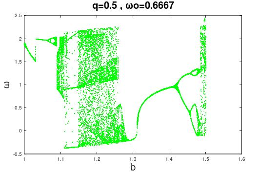

# The Chaotic Driven Pendulum
This project is built in Fortran. The backbone of this project is found in the files code-bifurcacion.f90 and codigo.f90. The rest of the files are mostly text files with numeric data and plots obtained after varying the parameters of the forced pendulum. The theory behind the pendulum can be found in the files TheChaoticPhysicalPendulum.pdf and Chaotic Driven Pendulum.pdf. The result of applying Newton Mechanics to this pendulum is a differential equation that was solved using the Runge–Kutta methods as explained by the teacher Marlón R. Fulla (National University of Colombia Medellin) in the files Complemento RK4.pdf and SESION16FISCOM.pdf 

# Bifurcation Diagram

